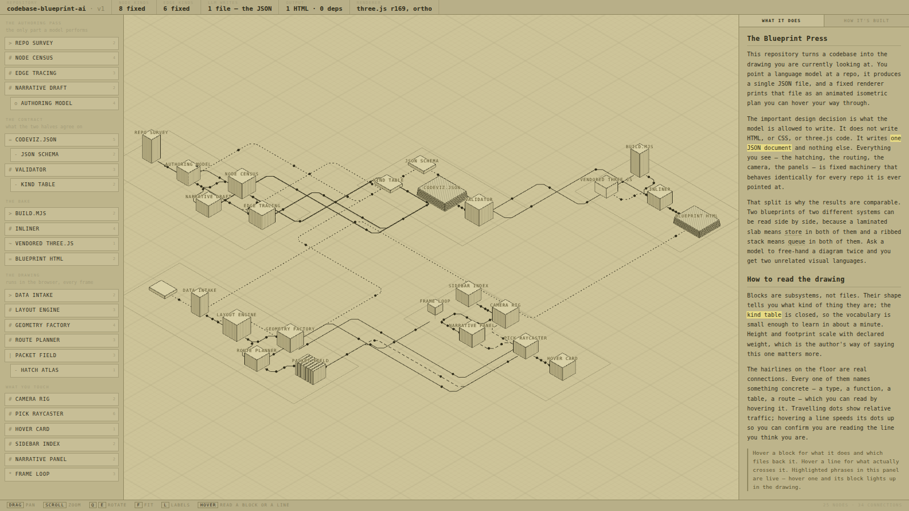

<h1>Gridwillow</h1>

**A 3D diagram language/DSL for software architecture.** 

[gridwillow.com](https://gridwillow.com)

Write a `.bp` file describing your servers, databases, queues and the data that
moves between them. Get back an animated isometric engineering drawing you can
pan, hover and click through — with a full inspector panel behind every block.




```
db orders "Orders" x1.4
  is    the ledger — every authorisation, capture and refund
  why >
    Postgres, single writer, replicas for reads. It is the only store in
    the system allowed to be the source of truth.
  fact  Engine  = Postgres 16
  list  Tables  = orders, order_items, captures, refunds
  link  Runbook = https://wiki/runbooks/orders-db
  env   DATABASE_URL PGBOUNCER_HOST

checkout -write-> orders "the authorisation"
  carry INSERT INTO orders (id, cart_id, state, amount_cents)
  why   Written before the processor is called, never after. If the process
        dies between the two, reconciliation finds the orphan by state.
  vol   0.8
```

---

## Use it

```bash
cargo install --path crates/gridwillow-cli   # the `bp` binary

bp check  infra.bp        # every problem at once, with line and column
bp export infra.bp        # one self-contained HTML file
bp fmt    infra.bp --write
```

Or open it in the app, which redraws every time you save:

```bash
cd app && cargo tauri dev
```

Try the repo describing itself, or a real 39-block system:

```bash
bp export examples/payments.bp           # a payments platform, 16 blocks
bp export examples/metalcraft-agent.bp   # a real Rust service, 39 blocks
bp export examples/self.bp               # this repo, describing itself
```

## Let an agent write it

```sh
./skills/install.sh          # OMP    -> ~/.omp/agent/skills/
./skills/install.sh claude   # Claude -> ~/.claude/skills/
```

Two skills, plain `SKILL.md` files in the format [OMP](https://omp.sh) and Claude
Code both discover:

- **`gridwillow-blueprint`** surveys a repo — manifest, entrypoints, migrations,
  deployment config — traces the call graph with `lsp`, and writes a `.bp`. It
  bundles its own grammar and prose references, so it works installed globally
  with no copy of this repo nearby.
- **`gridwillow-refresh`** takes a blueprint that already exists and checks every
  claim in it against the code: paths that moved, functions that were deleted,
  tables that were added. A diagram that is quietly wrong is worse than none.

The compiler is the grader — the skill is told to run `bp check` and fix what it
reports, so what comes back compiles.

## What you get

- **An isometric field of extruded blocks.** Eight shapes, closed set — but many
  words for each, so you write `db`, `topic`, `lb`, `cron`, whatever the thing is.
- **Orthogonal connectors** with chamfered corners, six line styles, and travelling
  packets whose density tracks the traffic you declared.
- **Hover a block** → what it is, what backs it, how many connections touch it.
- **Hover a connector** → both endpoints and the concrete payload that crosses it.
  Its packets speed up so you can see which line you're reading.
- **Click a block** → the inspector: facts, table names, env vars, source paths,
  runbook links, and every connection in and out — each one clickable to walk the
  graph.
- **A narrative panel** whose highlighted phrases are wired to the blocks. Hover a
  phrase and its block lights up, and the reverse.

Controls: drag to pan, scroll to zoom, `Q`/`E` to rotate ninety degrees, `F` to
fit, `L` for labels, `Esc` to deselect.

## How it fits together

```
       you (or a model)                fixed machinery
    ┌────────────────────┐   ┌──────────────────────────────────┐
    │  infra.bp          │──▶│ gridwillow      parse → compile  │
    │  the only file     │   │      │                           │
    │  anyone authors    │   │      ▼                           │
    └────────────────────┘   │    IR (JSON)                     │
                             │      │                           │
                             │      ├──▶ renderer/  three.js    │
                             │      │      ├─ bp export → .html │
                             │      │      └─ Gridwillow.app    │
                             │      └──▶ spec/*.schema.json     │
                             └──────────────────────────────────┘
```

| path | what it is |
|---|---|
| `skills/` | OMP / Claude Code skills — an agent that writes and refreshes blueprints |
| `PROMPT.md` | the same procedure as one long paste, if you prefer that |
| `PROTOCOL.md` | the language reference — read this one |
| `spec/blueprint.ebnf` | the formal grammar |
| `spec/blueprint-ir.schema.json` | the compiled IR the renderer consumes |
| `crates/gridwillow/` | parser, compiler, formatter, HTML exporter |
| `crates/gridwillow-cli/` | the `bp` binary |
| `renderer/` | the drawing — one implementation, shared by app and export |
| `app/` | the Tauri viewer with live reload |
| `site/` | gridwillow.com — a static page and a zero-dependency server |
| `vendor/` | three.js r169, pinned and checked in on purpose |
| `examples/` | a payments platform, a real Rust service, and this repo |

## Design notes

**The file is the product.** HTML is one renderer of it, the app is another.
Everything downstream of the `.bp` is fixed machinery that behaves identically
for every file it is ever handed — which is why two blueprints of two different
systems can be read side by side. A laminated slab means *store* in both.

**Indentation means nothing.** Every construct is one line starting with a
keyword, and a declaration owns the attribute lines after it. The most common
way a generated file goes wrong is inconsistent indentation, and it costs
nothing to be immune. The one exception is block scalars (`>` and `|`), which
follow YAML's convention.

**Errors point at lines.** `bp check` reports everything at once with a caret
under the column and a suggestion underneath. The app is more forgiving still: a
file that stops parsing keeps the last good drawing on screen with the errors
over it, because blanking the window on every half-typed line makes a
live-reload loop useless.

**The camera does not orbit.** Orthographic, pinned to the `(1,1,1)` axis —
exactly the classic isometric elevation. Pan, zoom, and ninety-degree snaps are
the entire control set. The moment you can tumble to an arbitrary angle, it
stops reading as an engineering drawing and starts reading as a 3D toy.

**No lights.** Faces are flat-coloured to fake the shading, which keeps every
edge crisp at any zoom and makes the render cost trivial. Hatching is drawn
procedurally into canvas textures at startup, so nothing ships as an image.

**Deterministic.** No `Math.random`, no clock-seeded values. Same file, same
drawing — so you can change one block, save, and diff what moved.

**three.js is vendored, not fetched.** Pinned at r169 and embedded in every
export as a base64 data URL inside an import map, which resolves under `file://`
where a relative module import would be blocked by CORS. It costs about 660 KB
per file and buys a deliverable that still renders identically, offline, in five
years.

## Building the app

Needs the Rust toolchain and the Tauri CLI (`cargo install tauri-cli --version '^2'`).

```bash
cd app && cargo tauri dev      # run it
cd app && cargo tauri build    # a .app / .dmg
```

The webview assets are assembled from `renderer/` by `app/src-tauri/build.rs`, so
there is one renderer and it cannot drift from what `bp export` produces.

## The site

`site/` is gridwillow.com: one static page, one exported blueprint running live in
the hero, and a dependency-free Node server so Railway can boot it with no install
step.

```bash
cd site && npm start        # http://localhost:3000
```

Deploy it by pointing a Railway service at this repo with **Root Directory** set
to `site`. Nixpacks finds `site/package.json`, runs `node server.js`, and never
touches the Rust half; redeploys only trigger on changes under that path.

`site/payments.blueprint.html` is the one build artifact in version control —
Railway builds `site/` alone and has no Rust toolchain to regenerate it. After
editing the sample, rebuild it and commit:

```bash
bp export examples/payments.bp -o site/payments.blueprint.html
```

## Licence

three.js is vendored under its own MIT licence (`vendor/three.LICENSE`).
